# Sequence Diagrams - News Backend

Tài liệu này chứa tất cả sequence diagrams cho các luồng API trong hệ thống News Backend.

---

## 1. Parent Authentication Flows

### 1.1 Parent Sign Up

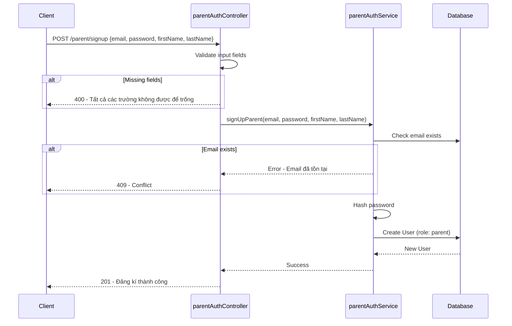
```mermaid
sequenceDiagram
    participant Client
    participant Controller as parentAuthController
    participant Service as parentAuthService
    participant DB as Database

    Client->>Controller: POST /parent/signup {email, password, firstName, lastName}
    Controller->>Controller: Validate input fields
    alt Missing fields
        Controller-->>Client: 400 - Tất cả các trường không được để trống
    end
    Controller->>Service: signUpParent(email, password, firstName, lastName)
    Service->>DB: Check email exists
    alt Email exists
        Service-->>Controller: Error - Email đã tồn tại
        Controller-->>Client: 409 - Conflict
    end
    Service->>Service: Hash password
    Service->>DB: Create User (role: parent)
    DB-->>Service: New User
    Service-->>Controller: Success
    Controller-->>Client: 201 - Đăng kí thành công
```

### 1.2 Parent Sign In

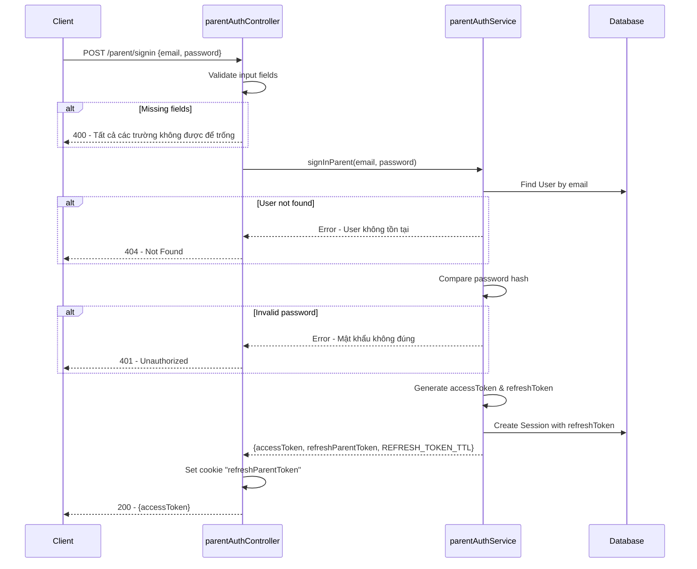
```mermaid
sequenceDiagram
    participant Client
    participant Controller as parentAuthController
    participant Service as parentAuthService
    participant DB as Database

    Client->>Controller: POST /parent/signin {email, password}
    Controller->>Controller: Validate input fields
    alt Missing fields
        Controller-->>Client: 400 - Tất cả các trường không được để trống
    end
    Controller->>Service: signInParent(email, password)
    Service->>DB: Find User by email
    alt User not found
        Service-->>Controller: Error - User không tồn tại
        Controller-->>Client: 404 - Not Found
    end
    Service->>Service: Compare password hash
    alt Invalid password
        Service-->>Controller: Error - Mật khẩu không đúng
        Controller-->>Client: 401 - Unauthorized
    end
    Service->>Service: Generate accessToken & refreshToken
    Service->>DB: Create Session with refreshToken
    Service-->>Controller: {accessToken, refreshParentToken, REFRESH_TOKEN_TTL}
    Controller->>Controller: Set cookie "refreshParentToken"
    Controller-->>Client: 200 - {accessToken}
```

### 1.3 Parent Sign Out

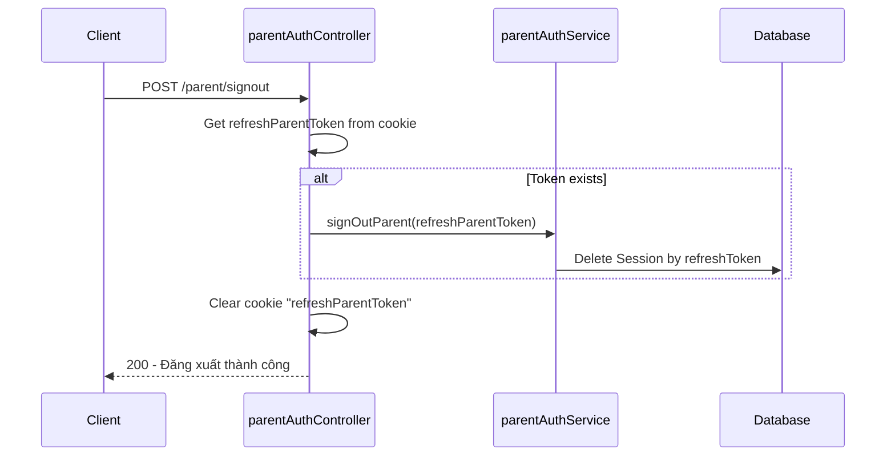
```mermaid
sequenceDiagram
    participant Client
    participant Controller as parentAuthController
    participant Service as parentAuthService
    participant DB as Database

    Client->>Controller: POST /parent/signout
    Controller->>Controller: Get refreshParentToken from cookie
    alt Token exists
        Controller->>Service: signOutParent(refreshParentToken)
        Service->>DB: Delete Session by refreshToken
    end
    Controller->>Controller: Clear cookie "refreshParentToken"
    Controller-->>Client: 200 - Đăng xuất thành công
```

### 1.4 Refresh Parent Token

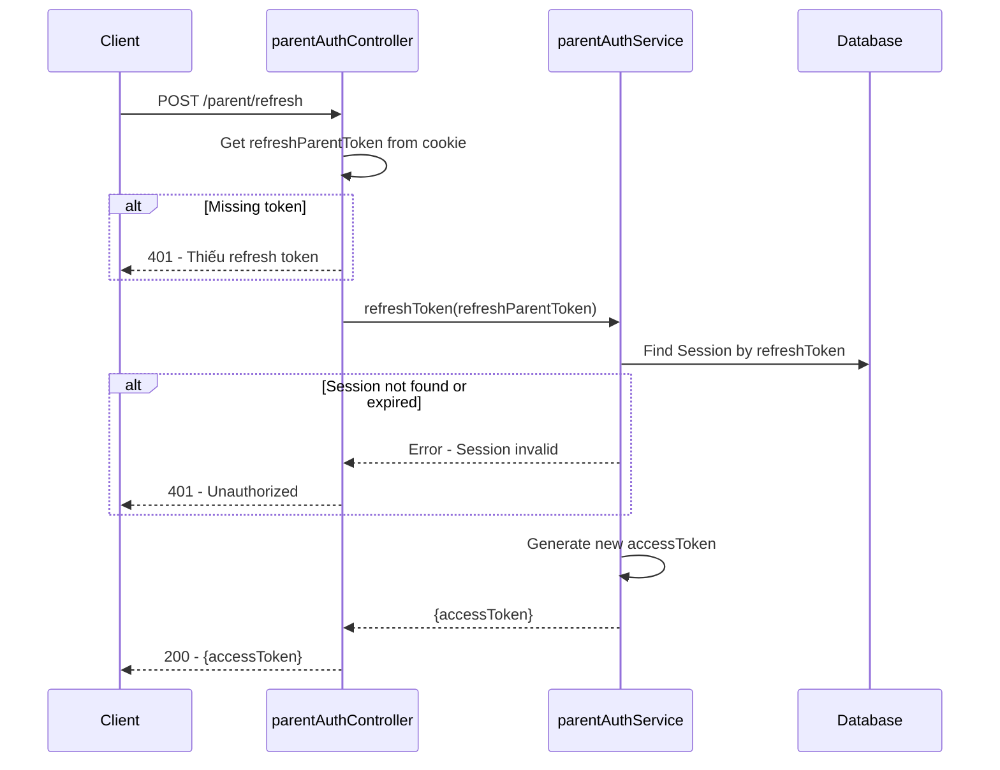
```mermaid
sequenceDiagram
    participant Client
    participant Controller as parentAuthController
    participant Service as parentAuthService
    participant DB as Database

    Client->>Controller: POST /parent/refresh
    Controller->>Controller: Get refreshParentToken from cookie
    alt Missing token
        Controller-->>Client: 401 - Thiếu refresh token
    end
    Controller->>Service: refreshToken(refreshParentToken)
    Service->>DB: Find Session by refreshToken
    alt Session not found or expired
        Service-->>Controller: Error - Session invalid
        Controller-->>Client: 401 - Unauthorized
    end
    Service->>Service: Generate new accessToken
    Service-->>Controller: {accessToken}
    Controller-->>Client: 200 - {accessToken}
```

### 1.5 Update Parent Profile

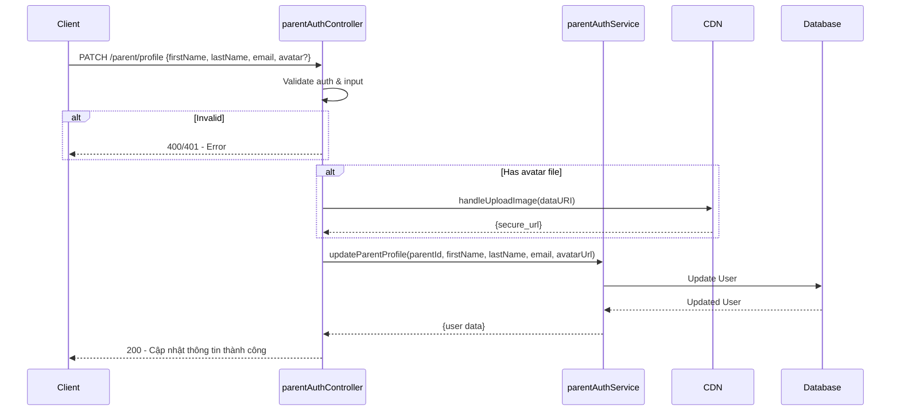
```mermaid
sequenceDiagram
    participant Client
    participant Controller as parentAuthController
    participant Service as parentAuthService
    participant Cloudinary as CDN
    participant DB as Database

    Client->>Controller: PATCH /parent/profile {firstName, lastName, email, avatar?}
    Controller->>Controller: Validate auth & input
    alt Invalid
        Controller-->>Client: 400/401 - Error
    end
    alt Has avatar file
        Controller->>Cloudinary: handleUploadImage(dataURI)
        Cloudinary-->>Controller: {secure_url}
    end
    Controller->>Service: updateParentProfile(parentId, firstName, lastName, email, avatarUrl)
    Service->>DB: Update User
    DB-->>Service: Updated User
    Service-->>Controller: {user data}
    Controller-->>Client: 200 - Cập nhật thông tin thành công
```

---

## 2. Child Authentication Flows

### 2.1 Validate Invite Code

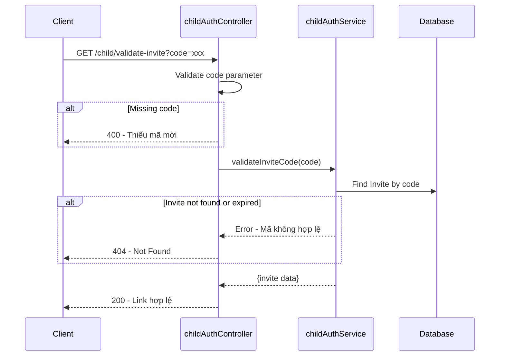
```mermaid
sequenceDiagram
    participant Client
    participant Controller as childAuthController
    participant Service as childAuthService
    participant DB as Database

    Client->>Controller: GET /child/validate-invite?code=xxx
    Controller->>Controller: Validate code parameter
    alt Missing code
        Controller-->>Client: 400 - Thiếu mã mời
    end
    Controller->>Service: validateInviteCode(code)
    Service->>DB: Find Invite by code
    alt Invite not found or expired
        Service-->>Controller: Error - Mã không hợp lệ
        Controller-->>Client: 404 - Not Found
    end
    Service-->>Controller: {invite data}
    Controller-->>Client: 200 - Link hợp lệ
```

### 2.2 Activate Child Account

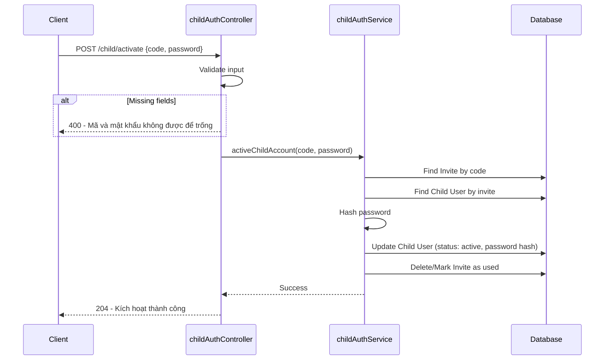
```mermaid
sequenceDiagram
    participant Client
    participant Controller as childAuthController
    participant Service as childAuthService
    participant DB as Database

    Client->>Controller: POST /child/activate {code, password}
    Controller->>Controller: Validate input
    alt Missing fields
        Controller-->>Client: 400 - Mã và mật khẩu không được để trống
    end
    Controller->>Service: activeChildAccount(code, password)
    Service->>DB: Find Invite by code
    Service->>DB: Find Child User by invite
    Service->>Service: Hash password
    Service->>DB: Update Child User (status: active, password hash)
    Service->>DB: Delete/Mark Invite as used
    Service-->>Controller: Success
    Controller-->>Client: 204 - Kích hoạt thành công
```

### 2.3 Child Sign In

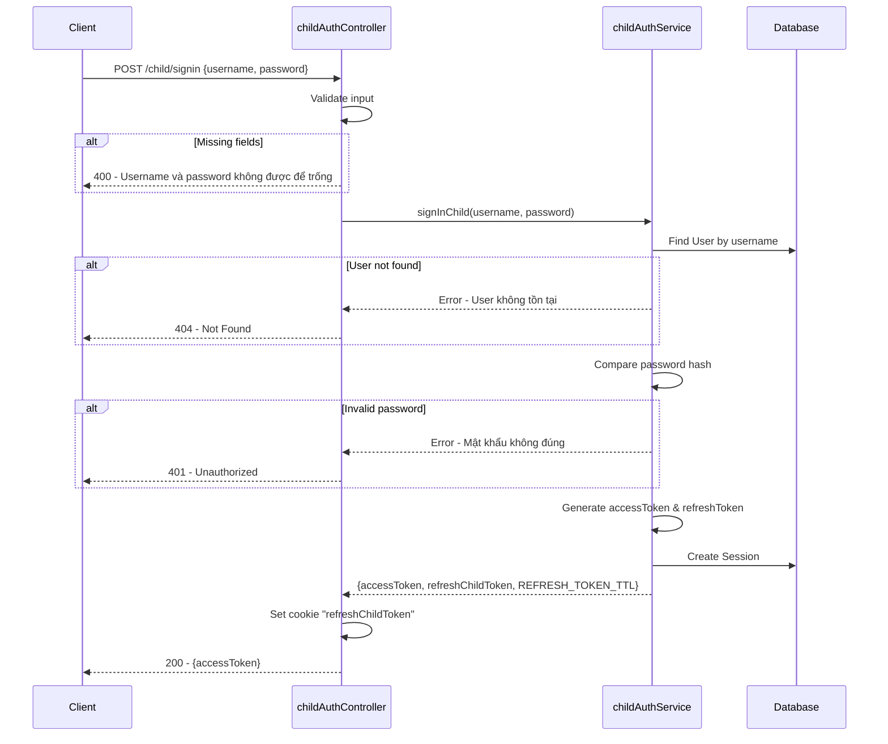
```mermaid
sequenceDiagram
    participant Client
    participant Controller as childAuthController
    participant Service as childAuthService
    participant DB as Database

    Client->>Controller: POST /child/signin {username, password}
    Controller->>Controller: Validate input
    alt Missing fields
        Controller-->>Client: 400 - Username và password không được để trống
    end
    Controller->>Service: signInChild(username, password)
    Service->>DB: Find User by username
    alt User not found
        Service-->>Controller: Error - User không tồn tại
        Controller-->>Client: 404 - Not Found
    end
    Service->>Service: Compare password hash
    alt Invalid password
        Service-->>Controller: Error - Mật khẩu không đúng
        Controller-->>Client: 401 - Unauthorized
    end
    Service->>Service: Generate accessToken & refreshToken
    Service->>DB: Create Session
    Service-->>Controller: {accessToken, refreshChildToken, REFRESH_TOKEN_TTL}
    Controller->>Controller: Set cookie "refreshChildToken"
    Controller-->>Client: 200 - {accessToken}
```

### 2.4 Child Sign Out

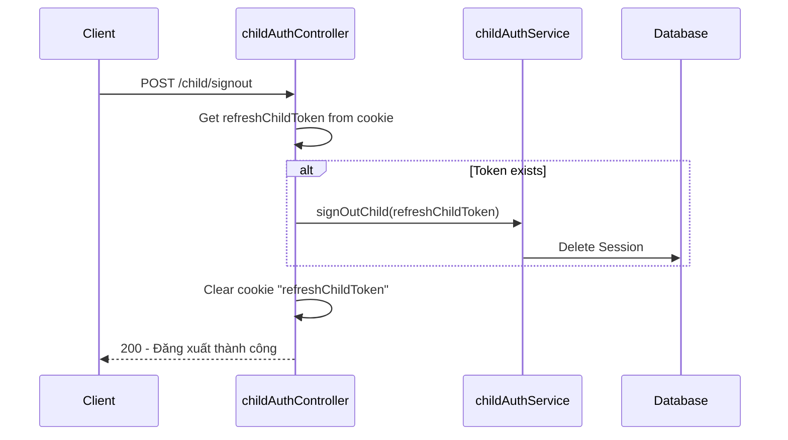
```mermaid
sequenceDiagram
    participant Client
    participant Controller as childAuthController
    participant Service as childAuthService
    participant DB as Database

    Client->>Controller: POST /child/signout
    Controller->>Controller: Get refreshChildToken from cookie
    alt Token exists
        Controller->>Service: signOutChild(refreshChildToken)
        Service->>DB: Delete Session
    end
    Controller->>Controller: Clear cookie "refreshChildToken"
    Controller-->>Client: 200 - Đăng xuất thành công
```

### 2.5 Get Child Strict Rules

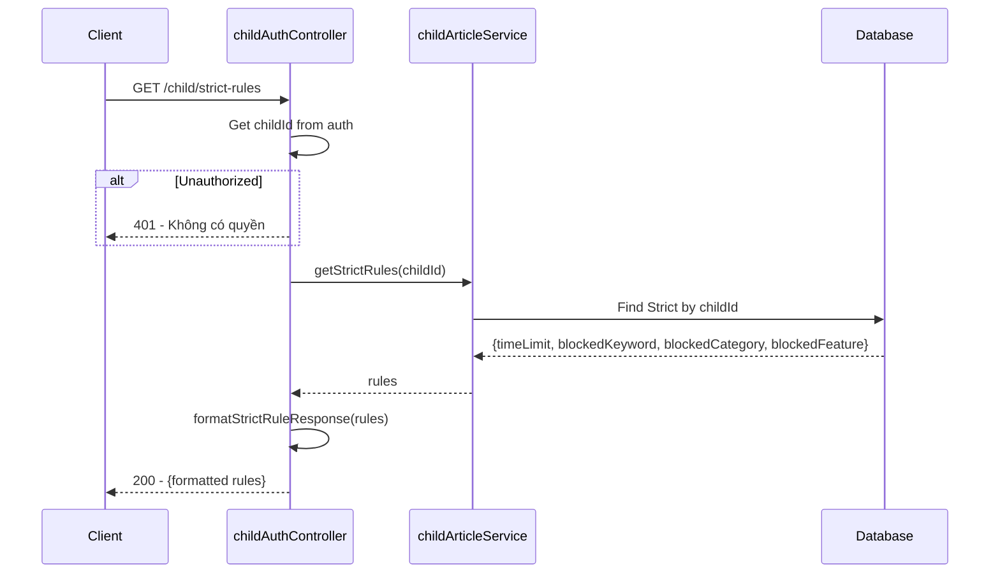
```mermaid
sequenceDiagram
    participant Client
    participant Controller as childAuthController
    participant Service as childArticleService
    participant DB as Database

    Client->>Controller: GET /child/strict-rules
    Controller->>Controller: Get childId from auth
    alt Unauthorized
        Controller-->>Client: 401 - Không có quyền
    end
    Controller->>Service: getStrictRules(childId)
    Service->>DB: Find Strict by childId
    DB-->>Service: {timeLimit, blockedKeyword, blockedCategory, blockedFeature}
    Service-->>Controller: rules
    Controller->>Controller: formatStrictRuleResponse(rules)
    Controller-->>Client: 200 - {formatted rules}
```

---

## 3. Parent Child Management Flows

### 3.1 Create Child Account with Invite Link

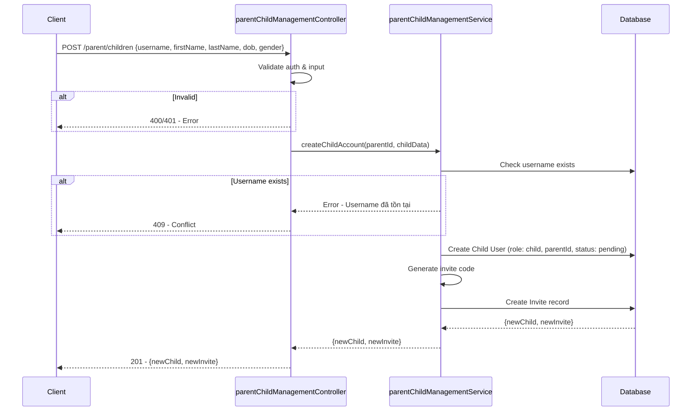
```mermaid
sequenceDiagram
    participant Client
    participant Controller as parentChildManagementController
    participant Service as parentChildManagementService
    participant DB as Database

    Client->>Controller: POST /parent/children {username, firstName, lastName, dob, gender}
    Controller->>Controller: Validate auth & input
    alt Invalid
        Controller-->>Client: 400/401 - Error
    end
    Controller->>Service: createChildAccount(parentId, childData)
    Service->>DB: Check username exists
    alt Username exists
        Service-->>Controller: Error - Username đã tồn tại
        Controller-->>Client: 409 - Conflict
    end
    Service->>DB: Create Child User (role: child, parentId, status: pending)
    Service->>Service: Generate invite code
    Service->>DB: Create Invite record
    DB-->>Service: {newChild, newInvite}
    Service-->>Controller: {newChild, newInvite}
    Controller-->>Client: 201 - {newChild, newInvite}
```

### 3.2 Get All Children

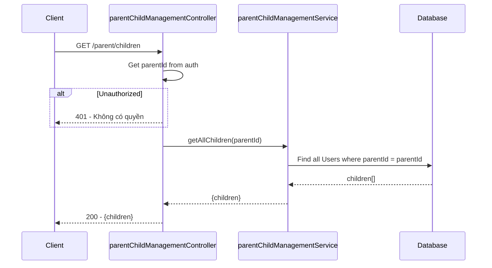
```mermaid
sequenceDiagram
    participant Client
    participant Controller as parentChildManagementController
    participant Service as parentChildManagementService
    participant DB as Database

    Client->>Controller: GET /parent/children
    Controller->>Controller: Get parentId from auth
    alt Unauthorized
        Controller-->>Client: 401 - Không có quyền
    end
    Controller->>Service: getAllChildren(parentId)
    Service->>DB: Find all Users where parentId = parentId
    DB-->>Service: children[]
    Service-->>Controller: {children}
    Controller-->>Client: 200 - {children}
```

### 3.3 Update Child Account

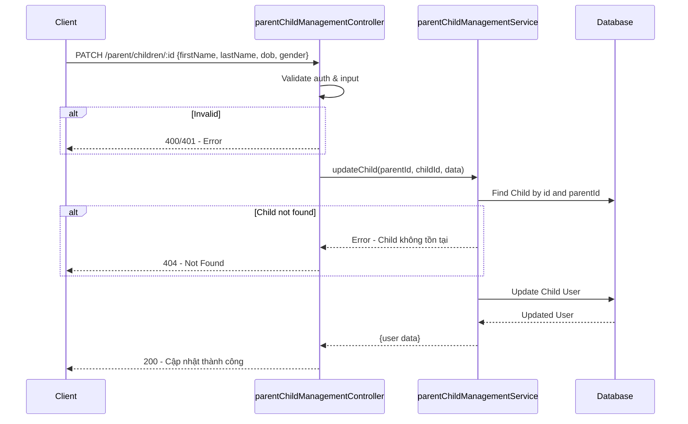
```mermaid
sequenceDiagram
    participant Client
    participant Controller as parentChildManagementController
    participant Service as parentChildManagementService
    participant DB as Database

    Client->>Controller: PATCH /parent/children/:id {firstName, lastName, dob, gender}
    Controller->>Controller: Validate auth & input
    alt Invalid
        Controller-->>Client: 400/401 - Error
    end
    Controller->>Service: updateChild(parentId, childId, data)
    Service->>DB: Find Child by id and parentId
    alt Child not found
        Service-->>Controller: Error - Child không tồn tại
        Controller-->>Client: 404 - Not Found
    end
    Service->>DB: Update Child User
    DB-->>Service: Updated User
    Service-->>Controller: {user data}
    Controller-->>Client: 200 - Cập nhật thành công
```

### 3.4 Set Child Strict Rules

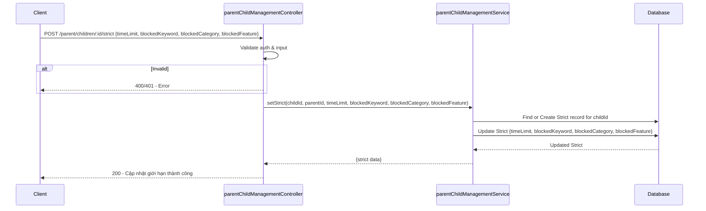
```mermaid
sequenceDiagram
    participant Client
    participant Controller as parentChildManagementController
    participant Service as parentChildManagementService
    participant DB as Database

    Client->>Controller: POST /parent/children/:id/strict {timeLimit, blockedKeyword, blockedCategory, blockedFeature}
    Controller->>Controller: Validate auth & input
    alt Invalid
        Controller-->>Client: 400/401 - Error
    end
    Controller->>Service: setStrict(childId, parentId, timeLimit, blockedKeyword, blockedCategory, blockedFeature)
    Service->>DB: Find or Create Strict record for childId
    Service->>DB: Update Strict {timeLimit, blockedKeyword, blockedCategory, blockedFeature}
    DB-->>Service: Updated Strict
    Service-->>Controller: {strict data}
    Controller-->>Client: 200 - Cập nhật giới hạn thành công
```

### 3.5 Get Child Activity

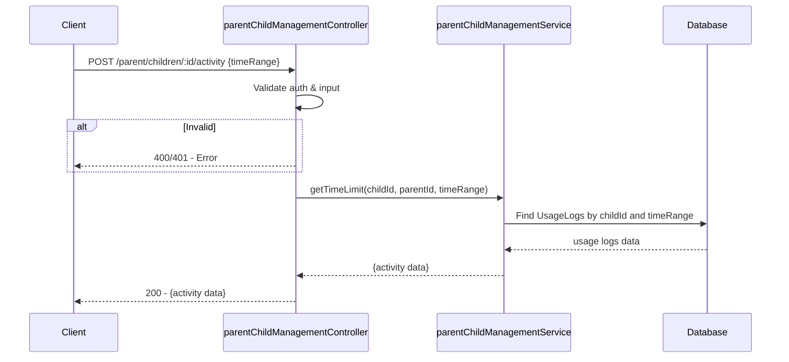
```mermaid
sequenceDiagram
    participant Client
    participant Controller as parentChildManagementController
    participant Service as parentChildManagementService
    participant DB as Database

    Client->>Controller: POST /parent/children/:id/activity {timeRange}
    Controller->>Controller: Validate auth & input
    alt Invalid
        Controller-->>Client: 400/401 - Error
    end
    Controller->>Service: getTimeLimit(childId, parentId, timeRange)
    Service->>DB: Find UsageLogs by childId and timeRange
    DB-->>Service: usage logs data
    Service-->>Controller: {activity data}
    Controller-->>Client: 200 - {activity data}
```

---

## 4. Child Article Flows

### 4.1 Get Articles (with filtering)

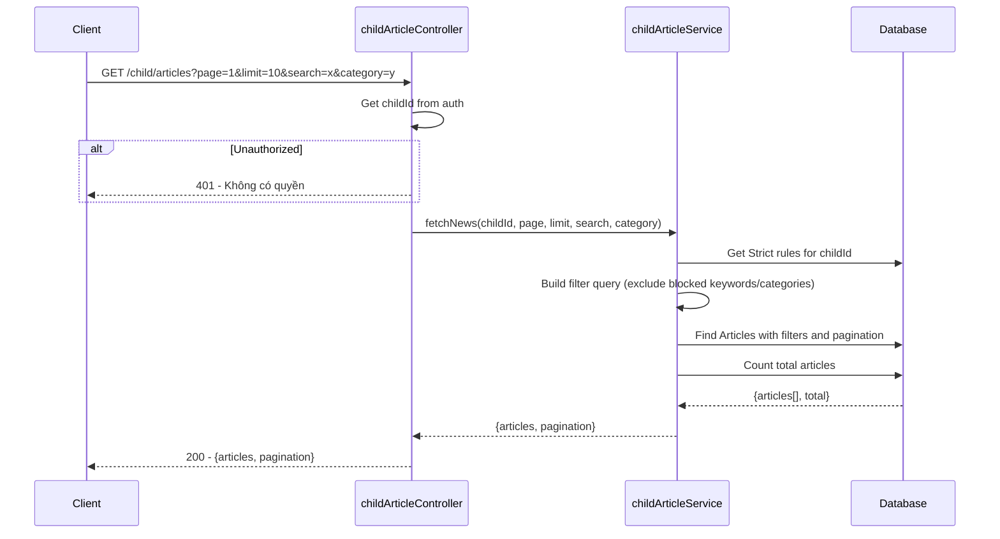
```mermaid
sequenceDiagram
    participant Client
    participant Controller as childArticleController
    participant Service as childArticleService
    participant DB as Database

    Client->>Controller: GET /child/articles?page=1&limit=10&search=x&category=y
    Controller->>Controller: Get childId from auth
    alt Unauthorized
        Controller-->>Client: 401 - Không có quyền
    end
    Controller->>Service: fetchNews(childId, page, limit, search, category)
    Service->>DB: Get Strict rules for childId
    Service->>Service: Build filter query (exclude blocked keywords/categories)
    Service->>DB: Find Articles with filters and pagination
    Service->>DB: Count total articles
    DB-->>Service: {articles[], total}
    Service-->>Controller: {articles, pagination}
    Controller-->>Client: 200 - {articles, pagination}
```

### 4.2 Get All Categories

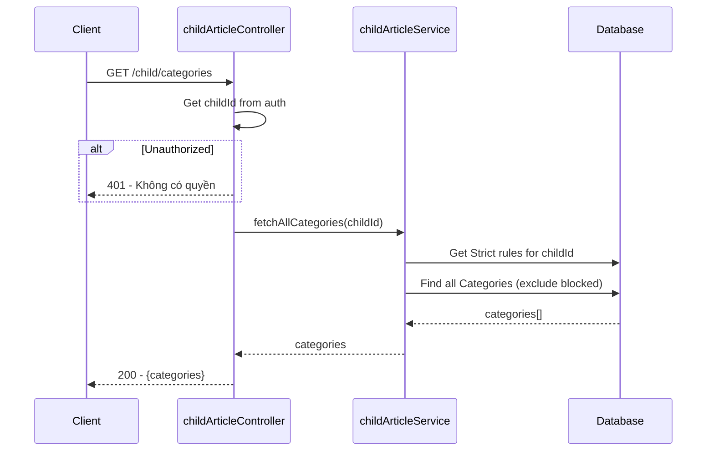
```mermaid
sequenceDiagram
    participant Client
    participant Controller as childArticleController
    participant Service as childArticleService
    participant DB as Database

    Client->>Controller: GET /child/categories
    Controller->>Controller: Get childId from auth
    alt Unauthorized
        Controller-->>Client: 401 - Không có quyền
    end
    Controller->>Service: fetchAllCategories(childId)
    Service->>DB: Get Strict rules for childId
    Service->>DB: Find all Categories (exclude blocked)
    DB-->>Service: categories[]
    Service-->>Controller: categories
    Controller-->>Client: 200 - {categories}
```

### 4.3 Get Article By ID

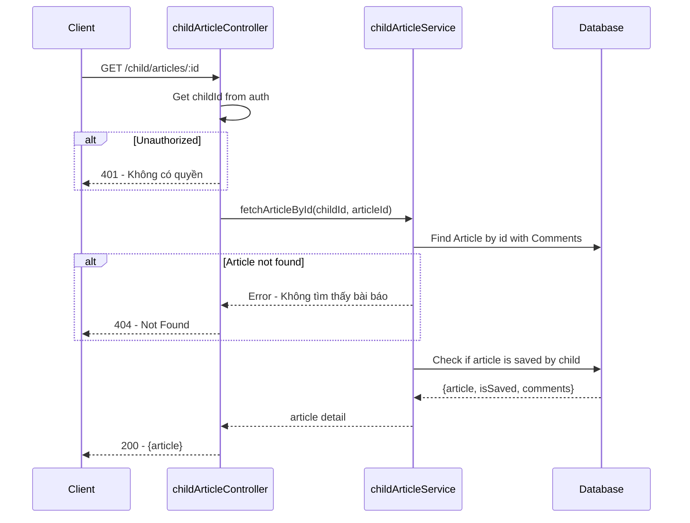
```mermaid
sequenceDiagram
    participant Client
    participant Controller as childArticleController
    participant Service as childArticleService
    participant DB as Database

    Client->>Controller: GET /child/articles/:id
    Controller->>Controller: Get childId from auth
    alt Unauthorized
        Controller-->>Client: 401 - Không có quyền
    end
    Controller->>Service: fetchArticleById(childId, articleId)
    Service->>DB: Find Article by id with Comments
    alt Article not found
        Service-->>Controller: Error - Không tìm thấy bài báo
        Controller-->>Client: 404 - Not Found
    end
    Service->>DB: Check if article is saved by child
    DB-->>Service: {article, isSaved, comments}
    Service-->>Controller: article detail
    Controller-->>Client: 200 - {article}
```

### 4.4 Post Comment

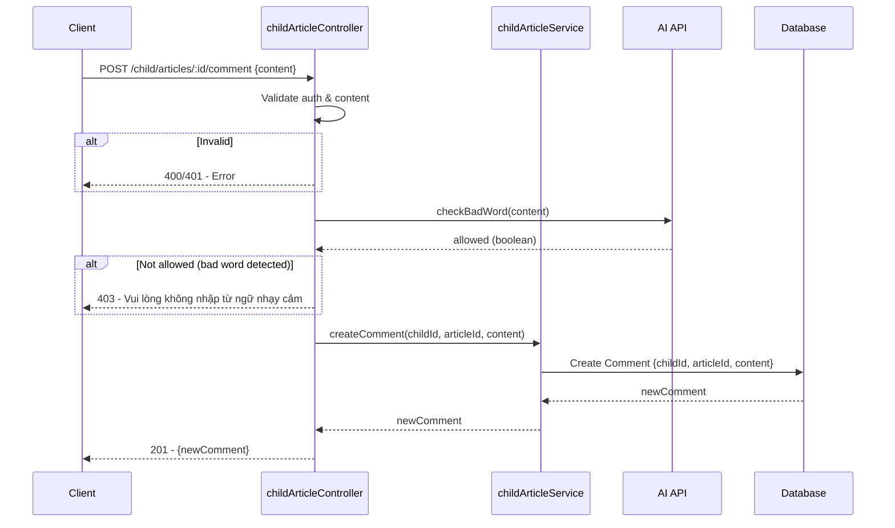
```mermaid
sequenceDiagram
    participant Client
    participant Controller as childArticleController
    participant Service as childArticleService
    participant BadWordAPI as AI API
    participant DB as Database

    Client->>Controller: POST /child/articles/:id/comment {content}
    Controller->>Controller: Validate auth & content
    alt Invalid
        Controller-->>Client: 400/401 - Error
    end
    Controller->>BadWordAPI: checkBadWord(content)
    BadWordAPI-->>Controller: allowed (boolean)
    alt Not allowed (bad word detected)
        Controller-->>Client: 403 - Vui lòng không nhập từ ngữ nhạy cảm
    end
    Controller->>Service: createComment(childId, articleId, content)
    Service->>DB: Create Comment {childId, articleId, content}
    DB-->>Service: newComment
    Service-->>Controller: newComment
    Controller-->>Client: 201 - {newComment}
```

### 4.5 Toggle Save Article

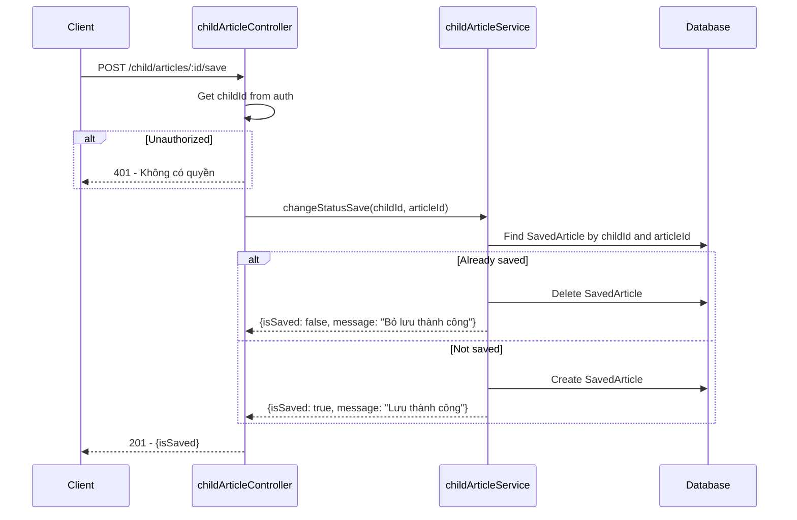
```mermaid
sequenceDiagram
    participant Client
    participant Controller as childArticleController
    participant Service as childArticleService
    participant DB as Database

    Client->>Controller: POST /child/articles/:id/save
    Controller->>Controller: Get childId from auth
    alt Unauthorized
        Controller-->>Client: 401 - Không có quyền
    end
    Controller->>Service: changeStatusSave(childId, articleId)
    Service->>DB: Find SavedArticle by childId and articleId
    alt Already saved
        Service->>DB: Delete SavedArticle
        Service-->>Controller: {isSaved: false, message: "Bỏ lưu thành công"}
    else Not saved
        Service->>DB: Create SavedArticle
        Service-->>Controller: {isSaved: true, message: "Lưu thành công"}
    end
    Controller-->>Client: 201 - {isSaved}
```

### 4.6 Get Saved Articles

```mermaid
sequenceDiagram
    participant Client
    participant Controller as childArticleController
    participant Service as childArticleService
    participant DB as Database

    Client->>Controller: GET /child/saved-articles?page=1&limit=10
    Controller->>Controller: Get childId from auth
    alt Unauthorized
        Controller-->>Client: 401 - Không có quyền
    end
    Controller->>Service: fetchSavedArticle(childId, page, limit)
    Service->>DB: Find SavedArticles by childId with Article details
    DB-->>Service: {savedArticles[], total}
    Service-->>Controller: {articles, pagination}
    Controller-->>Client: 200 - {articles, pagination}
```

---

## 5. Child Activity Flows

### 5.1 Log Child Activity

```mermaid
sequenceDiagram
    participant Client
    participant Controller as childActivityController
    participant Service as childActivityService
    participant DB as Database

    Client->>Controller: POST /child/activity/log {activeSeconds}
    Controller->>Controller: Validate auth & input
    alt Invalid
        Controller-->>Client: 400/401 - Error
    end
    Controller->>Service: logTime(childId, activeSeconds)
    Service->>DB: Find or Create UsageLog for today
    Service->>DB: Update UsageLog (add activeSeconds)
    DB-->>Service: Updated UsageLog
    Service-->>Controller: {usageLog}
    Controller-->>Client: 200 - Log hoạt động thành công
```

### 5.2 Update Child Streak

```mermaid
sequenceDiagram
    participant Client
    participant Controller as childActivityController
    participant Service as childActivityService
    participant DB as Database

    Client->>Controller: POST /child/streak/update
    Controller->>Controller: Get childId, calculate today & yesterday
    alt Unauthorized
        Controller-->>Client: 401 - Không có quyền
    end
    Controller->>Service: updateStreak(childId, today, yesterday)
    Service->>DB: Find Streak by childId
    alt No streak record
        Service->>DB: Create Streak {streakCount: 1, lastActiveDate: today}
    else Has streak record
        alt lastActiveDate == today
            Service-->>Controller: {current streak - no change}
        else lastActiveDate == yesterday
            Service->>DB: Update Streak {streakCount++, lastActiveDate: today}
            alt streakCount > maxStreak
                Service->>DB: Update maxStreak
            end
        else Break streak
            Service->>DB: Update Streak {streakCount: 1, lastActiveDate: today}
        end
    end
    DB-->>Service: Updated Streak
    Service-->>Controller: {streakCount, maxStreak}
    Controller-->>Client: 200 - {streak}
```

### 5.3 Get Child Streak

```mermaid
sequenceDiagram
    participant Client
    participant Controller as childActivityController
    participant Service as childActivityService
    participant DB as Database

    Client->>Controller: GET /child/streak
    Controller->>Controller: Get childId, calculate today
    Controller->>Service: getStreak(childId, today)
    Service->>DB: Find Streak by childId
    alt No streak
        Service-->>Controller: {streakCount: 0, maxStreak: 0}
    else Has streak
        DB-->>Service: {streakCount, maxStreak, lastActiveDate}
        Service-->>Controller: {streakCount, maxStreak}
    end
    Controller-->>Client: 200 - {streak}
```

---

## 6. Text-to-Speech Flow

### 6.1 Convert Article to Speech

```mermaid
sequenceDiagram
    participant Client
    participant Controller as textToSpeechController
    participant Service as textToSpeechService
    participant TTS_API as External TTS API
    participant DB as Database

    Client->>Controller: POST /child/tts {content, articleId}
    Controller->>Controller: Validate input
    alt Missing content or articleId
        Controller-->>Client: 404 - Thiếu nội dung/id bài báo
    end
    Controller->>Service: saveAudioUrl(articleId, content)
    Service->>DB: Check if Article already has audio_url
    alt Has cached audio
        Service-->>Controller: {audioBuffer from cache}
    else No cached audio
        Service->>TTS_API: Convert text to speech
        TTS_API-->>Service: audio buffer
        Service->>DB: Update Article with audio_url (optional)
        Service-->>Controller: {audioBuffer}
    end
    Controller->>Controller: Set headers (Content-Type: audio/mpeg)
    Controller-->>Client: Binary audio data
```

---

## 7. Public Article Flows (No Auth Required)

### 7.1 Get Public Articles

```mermaid
sequenceDiagram
    participant Client
    participant Controller as publicArticleController
    participant Service as publicArticleService
    participant DB as Database

    Client->>Controller: GET /public/articles?page=1&limit=10&search=x&category=y
    Controller->>Service: fetchNews(page, limit, search, category)
    Service->>DB: Find Articles with filters and pagination
    DB-->>Service: {articles[], total}
    Service-->>Controller: {articles, pagination}
    Controller-->>Client: 200 - {articles, pagination}
```

### 7.2 Get Public Article By ID

```mermaid
sequenceDiagram
    participant Client
    participant Controller as publicArticleController
    participant Service as publicArticleService
    participant DB as Database

    Client->>Controller: GET /public/articles/:id
    Controller->>Service: fetchArticleById(articleId)
    Service->>DB: Find Article by id
    alt Not found
        Service-->>Controller: Error - Không tìm thấy
        Controller-->>Client: 404 - Not Found
    end
    DB-->>Service: article
    Service-->>Controller: article
    Controller-->>Client: 200 - {article}
```

### 7.3 Get All Comments for Article

```mermaid
sequenceDiagram
    participant Client
    participant Controller as publicArticleController
    participant Service as publicArticleService
    participant DB as Database

    Client->>Controller: GET /public/articles/:id/comments?page=1&limit=5
    Controller->>Service: fetchAllComment(articleId, page, limit)
    Service->>DB: Find Comments by articleId with pagination
    DB-->>Service: {comments[], total}
    Service-->>Controller: {comments, pagination}
    Controller-->>Client: 200 - {comments, pagination}
```

---

## 8. Public Auth Flows

### 8.1 Validate Session

```mermaid
sequenceDiagram
    participant Client
    participant Controller as publicAuthController
    participant DB as Database

    Client->>Controller: GET /public/validate-session
    Controller->>Controller: Check cookies for refreshChildToken or refreshParentToken
    alt No token in cookie
        Controller-->>Client: 200 - {hasSession: false, role: null}
    end
    Controller->>DB: Find Session by refresh_token
    alt Session not found
        Controller-->>Client: 200 - {hasSession: false, role: null}
    end
    DB-->>Controller: Session with User.role
    Controller-->>Client: 200 - {hasSession: true, role: "parent"|"child"}
```

### 8.2 Force User Logout

```mermaid
sequenceDiagram
    participant Client
    participant Controller as publicAuthController

    Client->>Controller: POST /public/force-logout
    Controller->>Controller: Clear cookie "refreshToken"
    Controller->>Controller: Clear cookie "refreshChildToken"
    Controller->>Controller: Clear cookie "refreshParentToken"
    Controller-->>Client: 200 - Xóa phiên làm việc thành công
```

---

## Tổng quan hệ thống

```mermaid
flowchart TB
    subgraph Client["Client Apps"]
        ParentApp["Parent App"]
        ChildApp["Child App"]
    end

    subgraph API["API Layer"]
        subgraph Public["Public Routes"]
            PubAuth["publicAuthRoute"]
            PubArticle["publicArticleRoute"]
        end
        subgraph Parent["Parent Routes"]
            ParentAuth["parentAuthRoute"]
            ParentChild["parentChildManagementRoute"]
        end
        subgraph Child["Child Routes"]
            ChildAuth["childAuthRoute"]
            ChildArticle["childArticleRoute"]
            ChildActivity["childActivityRoute"]
            TTS["textToSpeechRoute"]
        end
    end

    subgraph Middleware["Middleware"]
        AuthMW["authMiddleware"]
    end

    subgraph Services["Service Layer"]
        ParentAuthSvc["parentAuthService"]
        ParentChildSvc["parentChildManagementService"]
        ChildAuthSvc["childAuthService"]
        ChildArticleSvc["childArticleService"]
        ChildActivitySvc["childActivityService"]
        TTSSvc["textToSpeechService"]
        PublicArticleSvc["publicArticleService"]
    end

    subgraph Database["Database Models"]
        User["User"]
        Article["Article"]
        Category["Category"]
        Comment["Comment"]
        Session["Session"]
        Invite["Invite"]
        SavedArticle["SavedArticle"]
        Streak["Streak"]
        Strict["Strict"]
        UsageLog["UsageLog"]
    end

    subgraph External["External Services"]
        Cloudinary["Cloudinary CDN"]
        TTSAPI["TTS API"]
        GeminiAI["Gemini AI"]
    end

    ParentApp --> PubAuth
    ParentApp --> ParentAuth
    ParentApp --> ParentChild
    ChildApp --> PubArticle
    ChildApp --> ChildAuth
    ChildApp --> ChildArticle
    ChildApp --> ChildActivity
    ChildApp --> TTS

    ParentAuth --> AuthMW
    ParentChild --> AuthMW
    ChildAuth --> AuthMW
    ChildArticle --> AuthMW
    ChildActivity --> AuthMW

    AuthMW --> ParentAuthSvc
    AuthMW --> ParentChildSvc
    AuthMW --> ChildAuthSvc
    AuthMW --> ChildArticleSvc
    AuthMW --> ChildActivitySvc
    AuthMW --> TTSSvc
    PubArticle --> PublicArticleSvc

    ParentAuthSvc --> User
    ParentAuthSvc --> Session
    ParentAuthSvc --> Cloudinary

    ParentChildSvc --> User
    ParentChildSvc --> Invite
    ParentChildSvc --> Strict
    ParentChildSvc --> UsageLog

    ChildAuthSvc --> User
    ChildAuthSvc --> Session
    ChildAuthSvc --> Invite
    ChildAuthSvc --> Cloudinary

    ChildArticleSvc --> Article
    ChildArticleSvc --> Category
    ChildArticleSvc --> Comment
    ChildArticleSvc --> SavedArticle
    ChildArticleSvc --> Strict
    ChildArticleSvc --> GeminiAI

    ChildActivitySvc --> UsageLog
    ChildActivitySvc --> Streak

    TTSSvc --> Article
    TTSSvc --> TTSAPI

    PublicArticleSvc --> Article
    PublicArticleSvc --> Category
    PublicArticleSvc --> Comment
```
